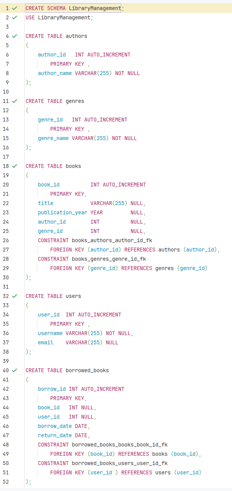
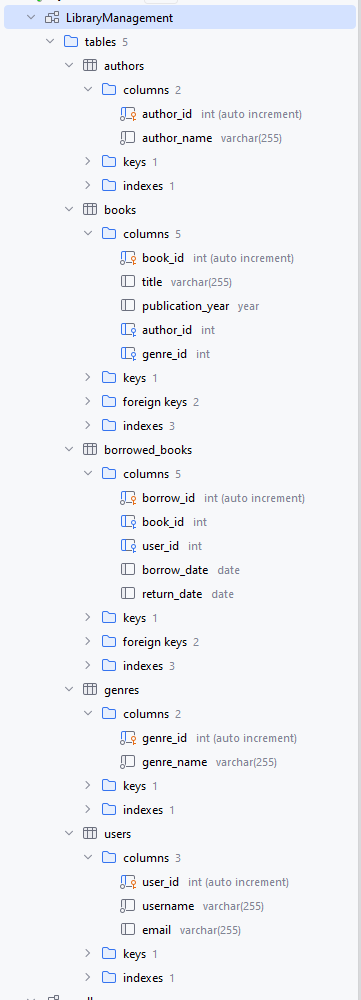
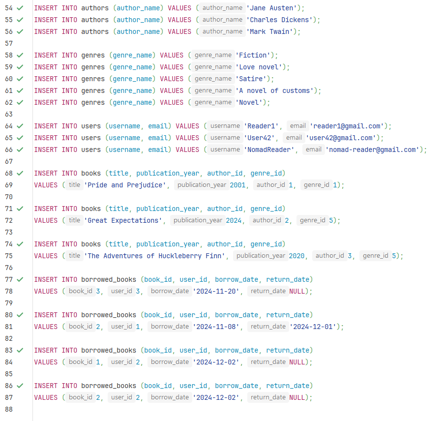
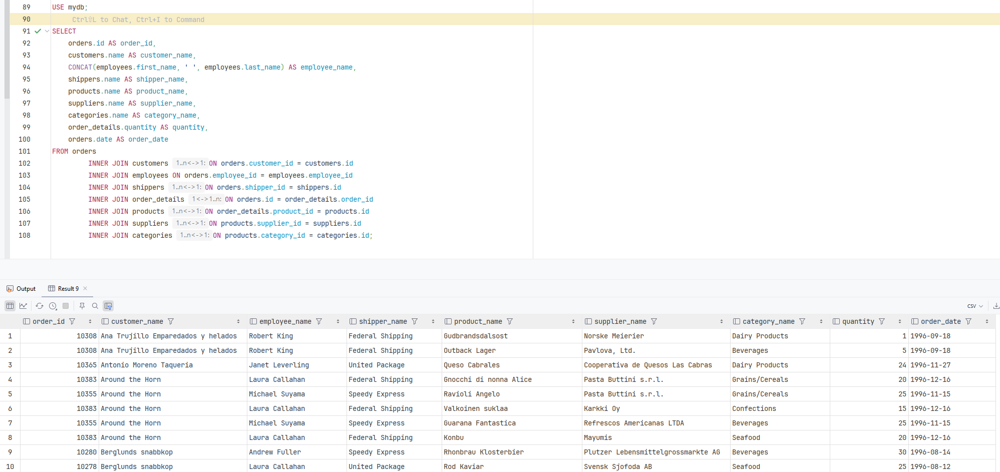
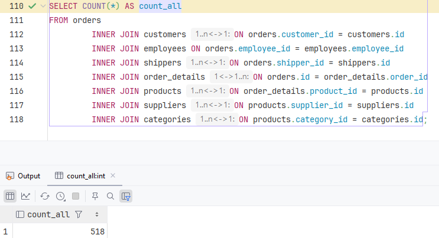
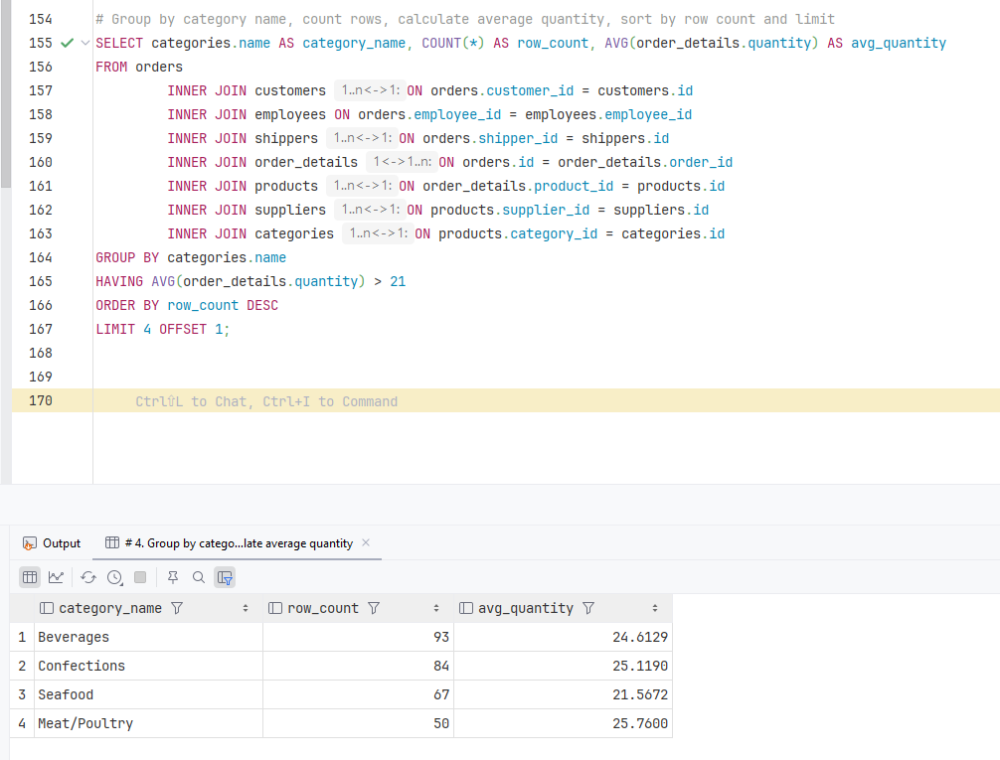

## Homework 4: Relational Databases: Concepts and Techniques

### 1.1:

### 1.2:

### 2:

### 3:

### 4.1:

### 4.2:

Кількість рядків у результаті залежить від типу з'єднання:

INNER JOIN обмежує кількість рядків, залишаючи тільки ті, що мають відповідності.

LEFT JOIN або RIGHT JOIN додають рядки з однієї таблиці навіть за відсутності відповідностей в іншій, збільшуючи кількість рядків у результаті.

Схоже що жодна з таблиць не має дублювань за ключами, тому кількість рядків буде визначатися кількістю рядків у найменшій таблиці з відповідностями.

### 4.3:

### 4.4:
